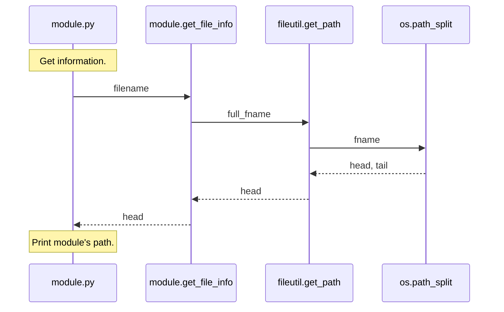

# diagrams-from-pdb
A repository stub for automating sequence diagram creation as *[pdb](https://realpython.com/python-debugging-pdb/)* runs.

#### Example 

A diagram similar to



should be created from debugging `module.py`
```python
# module.py

import fileutil


def get_file_info(full_fname):
    file_path = fileutil.get_path(full_fname)
    return file_path

filename = __file__
filename_path = get_file_info(filename)
print(f'path = {filename_path}')

# fileutil.py
def get_path(fname):
    """Return file's path or empty string if no path."""
    import os
    import pdb
    pdb.set_trace()
    head, tail = os.path.split(fname)
    return head

```


with debugging session
```bash
> c:\users\miranda and warren\projects\part2\python-project\debugger\example5.py(3)<module>()
-> import fileutil
(Pdb) c
> c:\users\miranda and warren\projects\part2\python-project\debugger\example5.py(12)<module>()
-> filename = __file__
(Pdb) n
> c:\users\miranda and warren\projects\part2\python-project\debugger\example5.py(13)<module>()
-> filename_path = get_file_info(filename)
(Pdb) n
> c:\users\miranda and warren\projects\part2\python-project\debugger\fileutil.py(6)get_path()
-> head, tail = os.path.split(fname)
(Pdb) n
> c:\users\miranda and warren\projects\part2\python-project\debugger\fileutil.py(7)get_path()
-> return head
(Pdb) n
--Return--
> c:\users\miranda and warren\projects\part2\python-project\debugger\fileutil.py(7)get_path()->'debugger'
-> return head
(Pdb) n
> c:\users\miranda and warren\projects\part2\python-project\debugger\example5.py(8)get_file_info()
-> return file_path
(Pdb) n
--Return--
> c:\users\miranda and warren\projects\part2\python-project\debugger\example5.py(8)get_file_info()->'debugger'
-> return file_path
(Pdb) n
> c:\users\miranda and warren\projects\part2\python-project\debugger\example5.py(14)<module>()
-> print(f'path = {filename_path}')
(Pdb) n
path = debugger
--Return--
> c:\users\miranda and warren\projects\part2\python-project\debugger\example5.py(14)<module>()->None
-> print(f'path = {filename_path}')
(Pdb) n
--Return--
> <string>(1)<module>()->None
```
